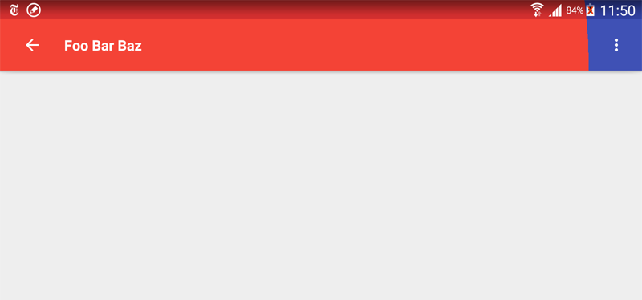

# Sample CircularRevealAnimation Toolbar

31 Janv 2017

Switching from a toolbar to another one by using a **smooth circular revealed** animation. That animation need to update the app bar **AND** status bar.

## results 

## Goal & idea

To do so, first we need to force the activity to display it content under the status bar by using `android:fitsSystemWindows=false` property on the main layout container and `<item name="android:windowTranslucentStatus">true</item>` in the App theme. Based on that we will not only create a Toolbar but also a view that will be displayed under the statusBar, juste to draw a nice background during the animation. Here is the point i don't like in my sample, but i didn't found any other solution.

Let's see the code

## styles.xml

    <!-- Base application theme. -->
    

we just added the `android:windowTranslucentStatus` property.

## app_bar_main.xml

    <android.support.design.widget.CoordinatorLayout
        xmlns:android="http://schemas.android.com/apk/res/android"
        xmlns:app="http://schemas.android.com/apk/res-auto"
        xmlns:tools="http://schemas.android.com/tools"
        android:layout_width="match_parent"
        android:layout_height="match_parent"
        android:fitsSystemWindows="false"
        tools:context="sample.test.fbo.circularrevealanimation.MainActivity">

        <android.support.design.widget.AppBarLayout
            android:layout_width="match_parent"
            android:layout_height="wrap_content"
            android:theme="@style/AppTheme.AppBarOverlay">

            <!-- used to force the two toolbars to display above each other -->
            <RelativeLayout
                android:layout_width="match_parent"
                android:layout_height="match_parent">

                <!-- initial toolbar layout with the status bar 
                and the original toolbar. That layout need to have a 
                background to show the elevation even if it will never 
                be visible (because of inner component backgrounds) -->
                <LinearLayout
                    android:layout_width="match_parent"
                    android:layout_height="wrap_content"
                    android:background="@color/colorPrimary"
                    android:elevation="4dp"
                    android:orientation="vertical">

                    <!-- status bar background: height of 24dp 
                    and initial color darker than the toolbar color -->
                    <View
                        android:layout_width="match_parent"
                        android:layout_height="24dp"
                        android:background="@color/colorPrimaryDark" />

                    <!-- main toolbar. A very basic one.-->
                    <android.support.v7.widget.Toolbar
                        android:id="@+id/toolbar"
                        android:layout_width="match_parent"
                        android:layout_height="?attr/actionBarSize"
                        android:background="?attr/colorPrimary"
                        app:popupTheme="@style/AppTheme.PopupOverlay" />

                </LinearLayout>
    
                <!-- reveal section layout. Here is our second toolbar
                section which will be animated. It contains a view to
                fake the status bar background and the second toolbar
                to display. -->
                <LinearLayout
                    android:id="@+id/revealedToolBar"
                    android:layout_width="match_parent"
                    android:layout_height="wrap_content"
                    android:background="@color/colorAccentDark"
                    android:elevation="4dp"
                    android:orientation="vertical"
                    android:visibility="invisible">
    
                    <!-- revealed status bar. Just to change it background. -->
                    <View
                        android:id="@+id/revealBackgroundStatus"
                        android:layout_width="match_parent"
                        android:layout_height="24dp"
                        android:background="@color/colorAccentDark" />
    
                    <!-- revealed toolbar. The second one with in our case 
                    a simple button and text inside. -->
                    <android.support.v7.widget.Toolbar
                        android:id="@+id/toolbar2"
                        android:layout_width="match_parent"
                        android:layout_height="?attr/actionBarSize"
                        android:background="@color/colorAccent"
                        app:popupTheme="@style/AppTheme.PopupOverlay">
                        
                        <!-- a click on that button will trigger 
                             the animation close event -->
                        <ImageButton
                            android:id="@+id/toolbar_arrow"
                            android:layout_width="48dp"
                            android:layout_height="48dp"
                            android:background="@android:color/transparent"
                            android:src="@drawable/arrow_left" />

                        <TextView
                            android:layout_width="match_parent"
                            android:layout_height="match_parent"
                            android:layout_marginLeft="24dp"
                            android:fontFamily="sans-serif-regular"
                            android:gravity="center_vertical"
                            android:text="Foo Bar Baz"
                            android:textColor="@android:color/white"
                            android:textSize="18sp"
                            android:textStyle="bold"
                            tools:text="Foo Bar Baz" />
                    </android.support.v7.widget.Toolbar>
                </LinearLayout>

            </RelativeLayout>
        </android.support.design.widget.AppBarLayout>

        <!-- content_main just contains a ToggleButton to trigger 
        the animation-->
        <include layout="@layout/content_main" />

    </android.support.design.widget.CoordinatorLayout>

Create 2 overlapped layout that contains a view to draw the status bar and a view to draw the toolbar. 

By default, the layout to animate is set invisible.

## MainActivity.java

    public class MainActivity extends AppCompatActivity implements NavigationView.OnNavigationItemSelectedListener, View.OnClickListener {

        private final static int ANIMATION_DURATION = 400;
        private ToggleButton mActionButton;
        private View mRevealedToolBar;
        private ImageButton mArrowButton;
        private boolean mIsHidden = true;

        @Override
        protected void onCreate(final Bundle savedInstanceState) {
            super.onCreate(savedInstanceState);
            setContentView(R.layout.activity_main);

            // main toolbar
            final Toolbar toolbar = (Toolbar) findViewById(R.id.toolbar);
            setSupportActionBar(toolbar);

            final DrawerLayout drawer = (DrawerLayout) findViewById(R.id.drawer_layout);
            final ActionBarDrawerToggle toggle = new ActionBarDrawerToggle(this, drawer, toolbar, R.string.navigation_drawer_open, R.string.navigation_drawer_close);
            drawer.setDrawerListener(toggle);
            toggle.syncState();

            final NavigationView navigationView = (NavigationView) findViewById(R.id.nav_view);
            navigationView.setNavigationItemSelectedListener(this);

            // trigger circular reveal animation
            mActionButton = (ToggleButton) findViewById(R.id.actionButton);
            mActionButton.setOnClickListener(this);

            // toolbar view to reveal. Inivisible by default
            mRevealedToolBar = findViewById(R.id.revealedToolBar);
            mRevealedToolBar.setVisibility(View.INVISIBLE);

            // button in revealed toolbar to dismiss it
            mArrowButton = (ImageButton) findViewById(R.id.toolbar_arrow);
            mArrowButton.setOnClickListener(this);
        }

        @Override
        public void onBackPressed() {
            final DrawerLayout drawer = (DrawerLayout) findViewById(R.id.drawer_layout);
            if (drawer.isDrawerOpen(GravityCompat.START)) {
                drawer.closeDrawer(GravityCompat.START);
            } else {
                super.onBackPressed();
            }
        }

        @Override
        public boolean onCreateOptionsMenu(Menu menu) {
            getMenuInflater().inflate(R.menu.main, menu);
            return true;
        }

        @Override
        public boolean onOptionsItemSelected(final MenuItem item) {
            if (item.getItemId() == R.id.action_settings) {
                return true;
            }
            return super.onOptionsItemSelected(item);
        }

        @SuppressWarnings("StatementWithEmptyBody")
        @Override
        public boolean onNavigationItemSelected(final MenuItem item) {
            DrawerLayout drawer = (DrawerLayout) findViewById(R.id.drawer_layout);
            drawer.closeDrawer(GravityCompat.START);
            return true;
        }

        @Override
        public void onClick(final View view) {

            if (view == mActionButton || view == mArrowButton) {

                // compute started X and Y co-ordinates for the animation + radius
                int x = mRevealedToolBar.getLeft();
                int y = mRevealedToolBar.getBottom();
                int startRadius = 0;
                int endRadius = Math.max(mRevealedToolBar.getWidth(), mRevealedToolBar.getHeight());
                int reverseStartRadius = endRadius;
                int reverseEndRadius = startRadius;

                if (mIsHidden) {

                    // show secondary toolbar
                    // performing circular reveal when icon will be tapped
                    Animator animator = ViewAnimationUtils.createCircularReveal(mRevealedToolBar, x, y, startRadius, endRadius);
                    animator.setInterpolator(new AccelerateDecelerateInterpolator());
                    animator.setDuration(ANIMATION_DURATION);

                    mRevealedToolBar.setVisibility(View.VISIBLE);
                    animator.start();
                    mIsHidden = false;

                } else {

                    // dismiss secondary toolbar
                    // performing circular reveal for reverse animation
                    Animator animate = ViewAnimationUtils.createCircularReveal(mRevealedToolBar, x, y, reverseStartRadius, reverseEndRadius);
                    animate.setInterpolator(new AccelerateDecelerateInterpolator());
                    animate.setDuration(ANIMATION_DURATION);

                    // to hide layout on animation end
                    animate.addListener(new AnimatorListenerAdapter() {
                        @Override
                        public void onAnimationEnd(Animator animation) {
                            super.onAnimationEnd(animation);
                            mRevealedToolBar.setVisibility(View.INVISIBLE);
                            mIsHidden = true;
                        }
                    });

                    mRevealedToolBar.setVisibility(View.VISIBLE);
                    animate.start();
                }
            }
        }
    }

So in `MainActivity`, after having listen the onclick event of my `ToggleButton`, i trigger the animation of my second toolbar group (status view + toolbar) by using `ViewAnimationUtils.createCircularReveal` methods. First argument is the view to animate, followed by the start coordinate of the animation and followed by the radius.

In onClick method i also launch a `reverse` animation when i click on the arrow or a second time on my ToggleButton.

François - 31 janv 2017

## Useful Links

* [Circular-Reveal-Animation project on GitHub](https://github.com/codepath/android_guides/wiki/Circular-Reveal-Animation)
* [Create Circular Reveal Animation And Ripple Effect like Whatsapp](http://pulse7.net/android/android-create-circular-reveal-animation-and-ripple-effect-like-whatsapp)
* [Simple Ripple + Reveal + Elevation tutorial](http://trickyandroid.com/simple-ripple-reveal-elevation-tutorial)